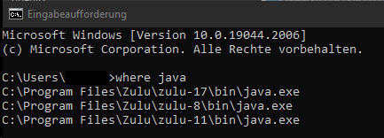
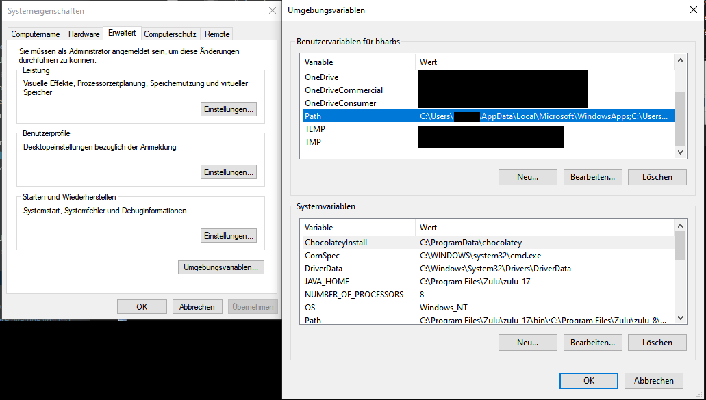
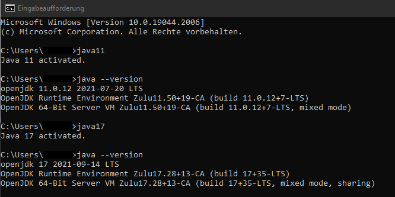

# windows-java-version-switcher

This is a small windows tool to switch between different Java Versions.

## Setup

### Java

In order to switch between Java Versions you need multiple Java Versions installed and get their path.

I've installed my Java Versions with [Chocolatey](https://chocolatey.org/install).
After that you can install different Java Versions with the following command (admin cmd):

```cmd
choco install zulu8 -y
choco install zulu11 -y
choco install zulu17 -y
```

You might want to add an Auto-Updater:

```cmd
choco upgrade all -y
choco install choco-upgrade-all-at-startup -y
```

After that you can find the Java Versions Paths with the following CMD command:

```cmd
where java
```

Output:



### Windows Path Variables

#### JAVA_HOME

In order to switch the Version we need to add JAVA_HOME to the System Path Variables.



To get there go into your Windows taskbar and select "System" and then "Advanced System Settings" and then "Environment Variables".
Here you can add a new System Variable with the name "JAVA_HOME" and one of the Java Paths from before.

#### Custom Scripts

Now please download this repository and extract it to a folder of your choice.
Then go into your user variables and add the path to the folder where you extracted the repository to the Path Variable.

If you did not install your Java Versions with Chocolatey you might need to change the paths for the scripts in the folder "scripts" to your needs.

## Test

To test please execute the following commands in your CMD:

```cmd
where java
java11
java --version
java17
java --version
```

This should result in:



java8 does not support "--version" so do not be surprised if you get an error.

Hope that helps :)
